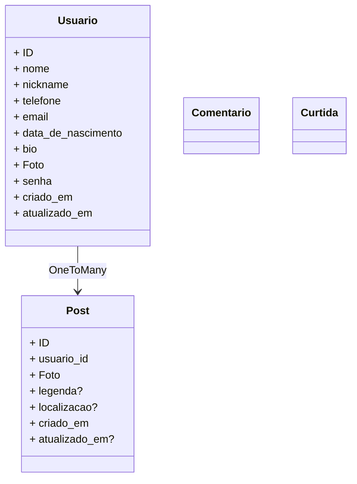

# API do Instagram

### Tecnologias
- NodeJS
- ExpressJS
- MySQL

### Recursos
- Usuários
- Post
- Comentários
- Curtidas

### Estrutura dos Dados

```mermaid
classDiagram
    Usuario --> Post: OneToMany
    
    class Usuario{
        + ID
        + nome
        + nickname
        + telefone
        + email
        + data_de_nascimento
        + bio
        + Foto
        + senha
        + criado_em
        + atualizado_em
    }

    class Post {
        + ID
        + usuario_id
        + Foto
        + legenda?
        + localizacao?
        + criado_em
        + atualizado_em?
    }

    class Comentario{


    }   

    class Curtida{

    } 

```